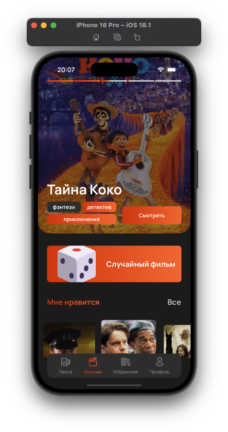

# MovieCatalog


# 📖 About
An application for viewing a catalog of films with the ability to rate, add to favorites and view reviews.

## 👨‍💻 iOS Deployment Target: 17.0 

## 💻 Tech Stack
- Swift
- UIKit + SwiftUI
- MVVM
- Clean Architecture
- SnapKit
- Alamofire
  
- Kingfisher (for download/upload images from URL)
- Keychain
- KeychainAccess
- Lottie (for animations)

## 🌟 Features

### Authentication & User Management
- Sign In and Sign Up functionality
- Profile customization
- Secure token-based authentication
- Auto logout on token expiration

### Movie Catalog
- Genre and date filtering
- Rating-based sorting
- Random movie suggestion
- Integration with Kinopoisk API
- Detailed movie information:
  - Cast and crew
  - Release date and runtime
  - Budget and rating
  - Genres
  - Description

### Social Features
- Movie reviews system
- Friends system
- Like/Dislike reviews
- Tinder-like movie swiping
- Instagram-style movie stories
- Favorite movies collection
- User activity feed

### Technical Features
- Intuitive tab-based navigation
- Smooth animations
- Image caching
- Russian/English localization
- Adaptive UI for all iPhone models

## 📱 Screenshots

<h3 align="center">Welcome Screen</h3>
<p align="center">
    
</p>

<h3 align="center">Authorization/Registration Screens</h3>
<p align="center">
    
    
    
    
</p>
<p align="center">
    
    
    
</p>

<h3 align="center">Feed Screen</h3>
<p align="center">
    
    
</p>

<h3 align="center">Movies Screen</h3>
<p align="center">
    
    
    
</p>

<h3 align="center">Favorites Screen</h3>
<p align="center">
    
</p>

<h3 align="center">Profile Screen</h3>
<p align="center">
    
</p>

<h3 align="center">Movie Details Screen</h3>
<p align="center">
    
    
    
    
    
</p>

<h3 align="center">Friends Screen</h3>
<p align="center">
    
</p>

## 🧑‍⚖️ License
```
MIT License

Copyright (c) 2024 Bogdan Tarchenko

Permission is hereby granted, free of charge, to any person obtaining a copy
of this software and associated documentation files (the "Software"), to deal
in the Software without restriction, including without limitation the rights
to use, copy, modify, merge, publish, distribute, sublicense, and/or sell
copies of the Software, and to permit persons to whom the Software is
furnished to do so, subject to the following conditions:

The above copyright notice and this permission notice shall be included in all
copies or substantial portions of the Software.

THE SOFTWARE IS PROVIDED "AS IS", WITHOUT WARRANTY OF ANY KIND, EXPRESS OR
IMPLIED, INCLUDING BUT NOT LIMITED TO THE WARRANTIES OF MERCHANTABILITY,
FITNESS FOR A PARTICULAR PURPOSE AND NONINFRINGEMENT. IN NO EVENT SHALL THE
AUTHORS OR COPYRIGHT HOLDERS BE LIABLE FOR ANY CLAIM, DAMAGES OR OTHER
LIABILITY, WHETHER IN AN ACTION OF CONTRACT, TORT OR OTHERWISE, ARISING FROM,
OUT OF OR IN CONNECTION WITH THE SOFTWARE OR THE USE OR OTHER DEALINGS IN THE
SOFTWARE.

```
